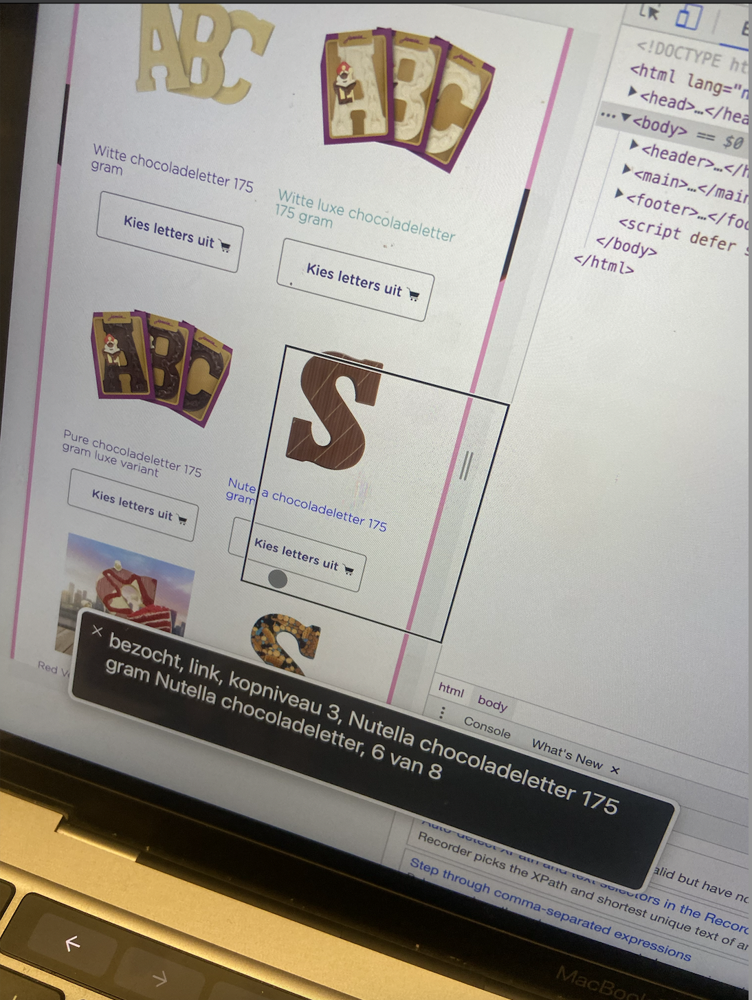
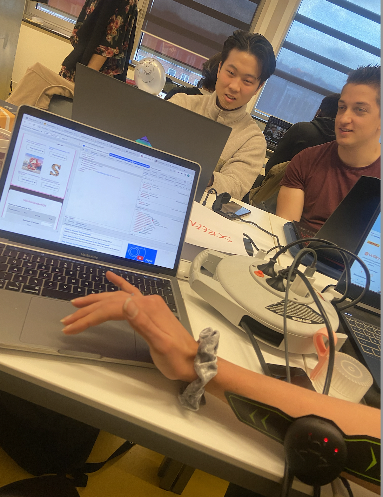
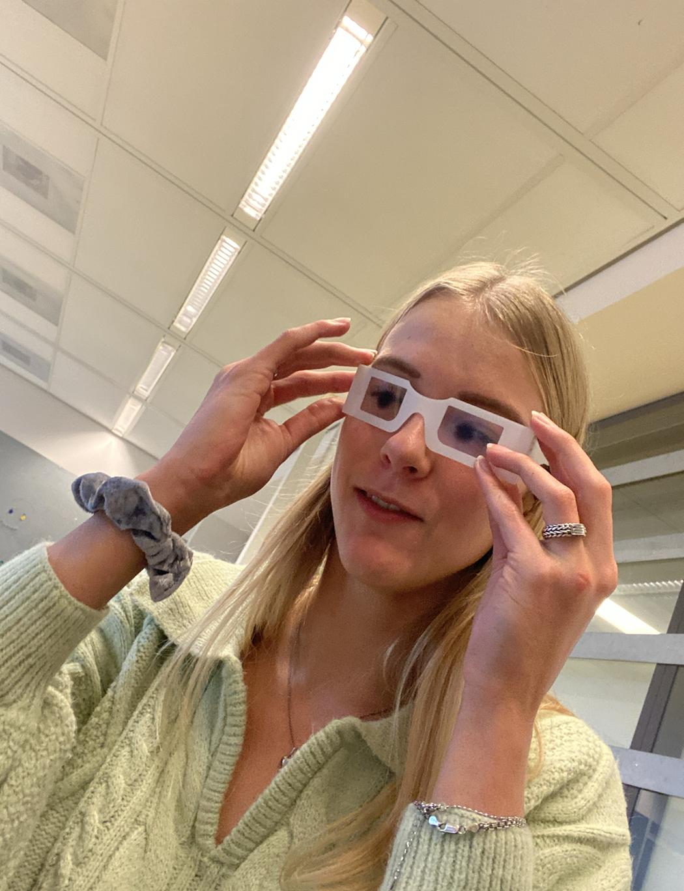
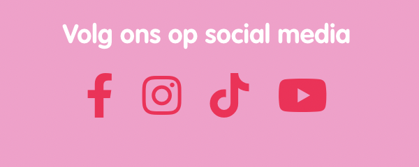
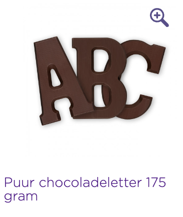

# Procesverslag
Markdown is een simpele manier om HTML te schrijven.  
Markdown cheat cheet: [Hulp bij het schrijven van Markdown](https://github.com/adam-p/markdown-here/wiki/Markdown-Cheatsheet).

Nb. De standaardstructuur en de spartaanse opmaak van de README.md zijn helemaal prima. Het gaat om de inhoud van je procesverslag. Besteedt de tijd voor pracht en praal aan je website.

Nb. Door *open* toe te voegen aan een *details* element kun je deze standaard open zetten. Fijn om dat steeds voor de relevante stuk(ken) te doen.

## Jij

uitwerken voor kick-off werkgroep

### Auteur:
Valena Herwig 

#### Je startniveau:
Blauw/Rood

#### Je focus:
Surface plane
 

## Je website

uitwerken voor kick-off werkgroep

### Je opdracht:
https://www.jamin.nl (Is een snoepwebsite)

#### srceenshot(s) van de eerste pagina (small srceen): 
Chocoladeletters pagina, dit is de landingspagina momenteel.

#### srceenshot(s) van de tweede pagina (small srceen):
candy pagina

 

## Toegankelijkheidstest 1/2 (week 1)

uitwerken na test in 1e werkgroep

### Bevindingen
Lijst met je bevindingen die in de test naar voren kwamen:

#### srceenreader

Het gebruik van de srceenreader op mijn gekozen website was vrij makkelijk en duidelijk. Doordat mijn gekozen website gebruik maakt van een paar knoppen en niet al teveel kleine links, loop je er vrij makkelijk doorheen. Het enige puntje waar mijn klasgenoot en ik tegenaan liepen was de eerste pagina waar je jouw winkel moet opzoeken via een postcode. Dat ging niet helemaal makkelijk en we kwamen ook niet verder. Dit is een scherm wat dus verbeterd kan worden. 

  
Het probleem bevinden zich alleen op het eerste scherm. Het kan opgelost worden door het scherm weg te halen, ook omdat dit toch een soort van privacyschending is doordat je jouw postcode moet delen. Maar het kan ook op een andere manier uitgewerkt worden, zoals in plaats van je postcode te delen, je de website kan zoeken gericht op alfabet.

#### Muis en Toetsenbord 
De website is goed te besturen met muis en toetsenbord. Doormiddel van de pijltjes kan je naar boven en beneden srcollen. Met de tab toets kan je navigeren door de website heen.
Er is dus geen oplossing nodig want de website biedt deze mogelijkheid al.

#### Motoriek (shocks, elastiekjes)
Mijn klasgenoot en ik vonden het moeilijk om de website te bedienen met de shocks. Je kan wel wat handelingen, zoals met de pijltjes srcollen, maar vaak zit je net een toets verkeerd door het trillen. Met de elastiekjes was wel te doen, omdat je nog je andere vingers had om te navigeren. Maar ik kan mij voorstellen dat als je in het gips zit met beide handen dat dit ook moeilijk wordt.

Mijn oplossingsvoorstel is dan ook eventueel om op de website voice-control te gebruiken. Mocht dit mogelijk zijn. Hierdoor kan de gebruiker communiceren met de website welke handelingen er gedaan moeten worden, zonder dat die gebruik maakt van het toetsenbord.

#### Visueel (brillen, contrast, kleurenblind, dark/light). 

Wat opviel is dat de website geen dark mode optie heeft. Nu scheelt het dat de website geen gebruik maakt van felle kleuren, maar toch zou het wel fijn zijn als de website dit aanbiedt. De contrasten zijn nog steeds duidelijk en de kleuren zijn duidelijk te onderscheiden, ondanks het zicht van iemand die kleurenblind is of anders ziet qua kleuren. Wat wel duidelijk te merken was tijdens het gebruik van de brillen, is bepaalde content niet opvalt of moeilijk te zien is. De afbeeldingen zijn bijvoorbeeld heel goed zichtbaar, omdat dit groot is maar de tekst eronder valt niet op als je minder ziet of last heb blur, suikerziekte of andere oogbeperkingen. 

Ik zat te denken als oplossing om de content op de website of groter te maken of een inzoom optie aan te bieden. Hierdoor kan de gebruiker die slechtziend is inzoomen op bepaalde content wat die moeilijk kan zien.

 

## Breakdownschets (week 1)

## Voortgang 1 (week 2)

uitwerken voor 1e voortgang

### Stand van zaken
Ik vind het nog moeilijk om grid toe te passen, omdat ik meerdere sections heb. Dit heb ik geprobeerd maar dit ging niet heel goed. Wel heb ik zelf een dropdown menu gemaakt. Heel vaak gaat het qua html wel goed, maar vanaf het moment dat ik grid of flex moet toepassen gaat het niet helemaal goed. Ik probeer op internet ook bronnen te vinden die mij daar bij kunnen helpen. Maar het is veel al div's en classes.

### Agenda voor meeting

Martijn:

-HTML Structuur presenteren

-Werking CSS ´order´ laten zien

-Positioning van plaatjes

-Eventuele tips van groepsgenoten

-Werking CSS ´order´ laten zien

-Positioning van plaatjes

-Eventuele tips van groepsgenoten

Jip:

-Voortgang met teamgenoten bespreken

-Planning van de afgelopen weken

-Hoe zijn jullie gestart?

Valena:

-Bespreken over de grid         

-Dropdown menu  

-Feedback van mijn team   

-Eventuele tips van teamgenoten

### Verslag van meeting

Ik heb veel meer geleerd over grid en hoe ik dit kan toepassen. De klassenassistenses hebben mij laten zien hoe ik mijn artikelen beter kan verdelen, door middel van grid. Ik vroeg feedback over mijn dropdown menu maar ze gaven mij als tip om daar later naar te kijken. Ik vond het een leerzame meeting, ook omdat je samenkomt en de kans hebt om jouw werk te vergeleken met de andere studenten. Door de meeting wist ik waar ik verder mee kon gaan en dat zijn mijn artikelen. Ik heb tot nu toe niet echt meegemaakt dat klassenassistentes mij goede advies gaven, maar ik heb echt veel gehad aan deze hulp. 

## Voortgang 2 (week 3)

uitwerken voor 2e voortgang

### Stand van zaken
Ik heb deze week hard gewerkt aan mijn website, ook met de hulp van de klassenassistenten. Ik ben druk bezig geweest met mijn footer, de grid en het stylen hiervan. Ik heb heel erg moeite gehad met het stylen van de sections apart van elkaar. Dit is uiteindelijk wel grotendeels gelukt. Ik heb vooral nog moeite met mijn tabel. Ik ga hierna binnen met het javascript gedeelte, daar had ik vorig jaar de meeste moeite mee dus ik hoop dat het nu grotendeels lukt. 

### Agenda voor meeting

Martijn:
Tot nu toe gaat het goed met mijn website. Ik moet alleen de secties nog vormgeven. Wat nog wel een belangrijk is zijn de navigatie en het daadwerkelijk responsive maken. Ik ga daar dit weekend hard mee aan de slag zodat ik volgende week kan gebruiken om veel vragen te stellen. Ik heb zelf hulp nodig met het maken van de navigatie en het verplaatsen van de content bij breakpoints.

Jip:
Ik heb al mij html erin staan ben nu bezig met mijn css. Maar ik ben helaas momenteel ziek waardoor ik niet aanwezig ben bij de 2de voortgang. 

Valena:
Ik zou wel meer willen weten over de tabel en wat de eisen zijn voor de tweede pagina. Ik heb nog moeite met mijn filter knop dus daar zou ik ook wel meer hulp bij willen hebben. Voor de rest ga ik aan de slag met Javascript en het verder uitwerken van animatie.

### Verslag van meeting

Tijdens de meeting hebben we met de docent bepaalde punten doorlopen, zoals grid en wat fr inhoud. Daarbij hebben we gekeken welke tweedepagina ik kan gaan maken en weet ik nu wat voor menu het beste aansluit op mijn website. Ik had niet zozeer specifieke vragen over mijn code, maar meer de oplevering en dit is duidelijk beantwoord. Ik weet nu waar ik gerichter naar moet kijken en hoe ik de aankomende twee weken nog te werk ga. Dat is nog meer letten op details, aan de slag met javascript, mijn eerste pagina afronden, aan de tweede beginnen en animatie toevoegen. 

## Toegankelijkheidstest 2/2 (week 4)

uitwerken na test in 8e werkgroep

### Bevindingen
De website is verbeterd doordat er nu gebruik is gemaakt van semantische code. Als de gebruiker nu over de opties heen gaat en focust op de a, zoomt die in. 

#### srceenreader
Door het testen met de screenreader kwamen wij erachter dat mijn buttons nog niet duidelijk stonden qua code. Voor de rest sprak die duidelijk de links en kopjes op. Maar ik ga nog even mijn buttons aanpassen, zodat dat ook klopt qua code.

#### Muis en Toetsenbord 
Muis en toetsenbord werkt goed, net zoals op de huidge website. Je kan er goed doorheen tabben en ook scrollen.

#### Motoriek (shocks, elastiekjes)
De website is goed te bedienen, ondanks de shocks en elastiekjes. Het gaat allemaal wel een stuk langzamer, maar het is wel te doen. Dit kan bijvoorbeeld door de pijltjes toets te gebruiken. 

#### Visueel (brillen, contrast, kleurenblind, dark/light). 
Met de brillen was er niet veel verschil te zien. Bepaalde brillen, zoals Central field loss was er weimnig te zien maar dat valt moeilijk op te lossen. Bij de field loss en blur kwam er wel duidelijk naar voren dat de tekst wat groter moet, dus dat is zeker iets om op te lossen. Darkmode heb ik nog niet toegepast dus dat konden we nog niet uittesten, maar door de toepassing colorblindly konden we zien hoe de website eruit ziet in verschillende kleuren. 

## Voortgang 3 (week 4)

uitwerken voor 3e voortgang

### Stand van zaken
Wat goed ging is dat ik mijn eerste pagina al bijna af heb, zoals die hoort. Ik heb helaas nog moeite met de social media iconen toevoegen en javascript. Met de screenshots hieronder laat ik het verschil zien tussen de huidige website en wat er bij mij nog ontbreekt.

  
 
Dit is de social media van de huidige website en zo moet het uiteindelijk ook op mijn website komen te staan.

 

Daarnaast heb ik nog geen animatie of javascript toegepast dus daar moet ik wel nog aan beginnen. Ik heb daar best wel nog moeite mee en wil dat dan ook graag bespreken tijdens de meeting. Voor de rest ben ik wel al begonnen aan mijn tweede pagina, heb ik al aparte stylensheets. Tevens heb ik ook een vergrootglas toegevoegd waar ik best wel trots op. Dit is hieronder terug te zien:

 

Martijn:
Op de blogs pagina wil ik dat de kolommen allemaal even grote afbeeldingen hebben. Ik wil op de index pagina de koffie plaatjes naast elkaar zetten. Hier heb ik hulp nodig bij het positioneren en responsive maken

Jip:
Ik volg helaas niet meer de lessen mee en laat dit vak vallen.

Valena:
Ik zou graag hulp willen met mijn social media iconen en hoe ik die van kleur makkelijk kan laten veranderen. Doordat dit niet standaard knoppen of links zijn begrijp ik niet helemaal hoe ik dat kan oplossen. Daarbij weet ik niet precies hoe ik een filtermenu kan toepassen en stylen binnen mijn pagina. Voor de rest gaat het aardig goed en denk ik dat ik zelfstandig aan de slag kan gaan.

 

### Verslag van meeting
We hebben gekeken naar hoe we de knoppen beter kunnen stylen. Martijn heeft met mij gekeken hoe we toepasselijke svg's kunnen vinden die we van kleur kunnen laten veranderen, maar helaas hebben we het probleem niet kunnen verhelpen.

## Eindgesprek (week 5)

uitwerken voor eindgesprek

### Je uitkomst - karakteristiek srceenshots:

### Dit ging goed/Heb ik geleerd: 
Korte omschrijving met plaatjes

### Dit was lastig/Is niet gelukt:
Korte omschrijving met plaatjes

## Bronnenlijst

  
continu bijhouden terwijl je werkt

  Nb. Wees specifiek ('css-tricks' als bron is bijv. niet specifiek genoeg).

  1. Winkelmandje icoon. Afkomstig van https://thenounproject.com/icon/shopping-cart-5285603/
  2. Vergrootglas icoon. Afkomstig van https://thenounproject.com/icon/zoom-in-103677/
  3. Youtube icoon. Afkomstig van https://iconscout.com/icon/youtube-1464540
  4. Instagram icoon. Afkomstig van https://iconscout.com/icon/instagram-218
  5. Facebook icoon. Afkomstig van https://iconscout.com/icon/facebook-1464523
  6. Tiktok icoon. Afkomstig van https://iconscout.com/icon/tiktok-3185105
  7. Filtermenu. Chocoladeletter icoon afkomstig van https://www.flaticon.com/free-icon/abc_709469?term=alphabet&page=1&position=8&page=1&position=8&related_id=709469&origin=search
  8. Filtermenu. New icoon afkomstig van https://www.flaticon.com/free-icon/new_4456928?term=new&page=1&position=81&page=1&position=81&related_id=4456928&origin=search
  9. Filtermenu. Snoep icoon afkomstig van https://www.flaticon.com/free-icon/candy_3151998?term=candy&page=1&position=40&page=1&position=40&related_id=3151998&origin=search
  10. Filtermenu. Chocolade icoon afkomstig van https://www.flaticon.com/free-icon/chocolate_1660712?term=chocolate&page=1&position=4&page=1&position=4&related_id=1660712&origin=search
  11. Filtermenu. Tiktok icoon afkomstig van https://www.flaticon.com/free-icon/tik-tok_3046125?term=tiktok&page=1&position=3&page=1&position=3&related_id=3046125&origin=search
  12. Filtermenu. Gifts icoon afkomstig van https://www.flaticon.com/free-icon/gift-box_1692277?term=gifts&page=1&position=7&page=1&position=7&related_id=1692277&origin=search

